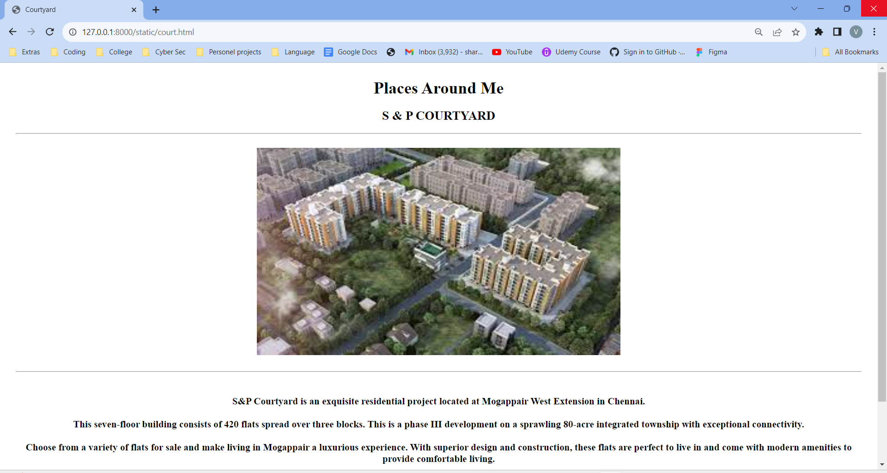

# Ex04 Places Around Me
## AIM
To develop a website to display details about the places around my house.

## DESIGN STEPS

### STEP 1
Create a Django admin interface.

### STEP 2
Download your city map from Google.

### STEP 3
Using ```<map>``` tag name the map.

### STEP 4
Create clickable regions in the image using ```<area>``` tag.

### STEP 5
Write HTML programs for all the regions identified.

### STEP 6
Execute the programs and publish them.

## CODE
```
map.html

<!DOCTYPE html>
<html lang="en">
<head>
    <meta charset="UTF-8">
    <meta name="viewport" content="width=device-width, initial-scale=1.0">
    <title>My Map</title>
</head>
<body style="background-color: rgb(255, 247, 230); margin: 50px;">
    <h1 align="center">
        <font color="red"><b>S & P Living Spaces </b></font>
        </h1>
        <h3 align="center">
        <font color="blue"><b>Places Around Me</b></font>
        </h3>
        <center>
        
        <map name="MyArea">
        <area shape="circle" coords="400,320,50" href="ess.html" title="S&P Essense">
        <area shape="circle" coords="600, 350,50" href="home.html" title="S&P Living Spaces">
        <area shape="circle" coords="1000,240,50" href="aachisch.html" title="Aachi Global School">
        <area shape="circle" coords="250,180,50" href="court.html" title="S&P Courtyard">
        <area shape="circle" coords="400, 450, 50" href="park.html" title="Park">
        </map>
        <h2>This is a map of my neighbourhood. </h2>
        </center>
        
</body>
</html>


home.html

<!DOCTYPE html>
<html lang="en">
<head>
    <meta charset="UTF-8">
    <meta name="viewport" content="width=device-width, initial-scale=1.0">
    <title>Living Spaces (Home)</title>
</head>
<body style="margin: 30px;">
    <h1 align="center">Places Around Me</h1>
<h2 align="center">S & P LIVING SPACES</h2>
<hr size="2" >
<br>
<center>
<br><br>
<hr>
<br>
<h3>
    S&P Living Spaces in Kil Ayanambakkam, Chennai is a popular society in the city, it is well made and has all the amenities you need. 
    <br><br>
    There is ample True in this society, your vehicle will be fully protected and safe here. Have you seen the play area for children here? If you have kids, they will love it. 
    <br><br>
    You won't have to only look for houses on the ground floor, there are lift that you can use to get you to any floor. Moving into a home with wifi connectivity is extremely convenient, that is exactly what this society offers you. 
    <br><br>
    If you like doing some cardio, or just like to focus on weights, this society has a well equipped gym that you should check out. Being sustainable as a society is very important, we have started by having a rainwater harvesting in the society.
</h3>
<br><br><br>
</center>

</body>
</html>


ess.html

<!DOCTYPE html>
<html lang="en">
<head>
    <meta charset="UTF-8">
    <meta name="viewport" content="width=device-width, initial-scale=1.0">
    <title>S & P Essense</title>
</head>
<body style="margin: 30px;">
    <h1 align="center">Places Around Me</h1>
<h3 align="center">S & P ESSENSE</h3>
<hr size="2" >
<br>
<center>
<br><br>
<hr>
<br>
<h3>
    S&P Essense is located in Mogappair West Extension on the periphery of Anna Nagar, an upmarket residential locality in Chennai adjoining S&P Living Spaces, a 7 lakh sq. ft. self-contained residential township built on 10.91 acres.
<br><br>
The township is being developed in a land area of 3.3 acres with 200 well-appointed 1.5BHK, 2BHK & 3BHK apartment units in sizes ranging from 560 sq ft to 1761 sq ft in stilt plus four configurations.
<br><br>
S&P Essense shall have amenities like swimming pool, Gym, Library lounge, community hall etc. housed in a separate clubhouse block. S&P Essense infrastructure will include a Water Treatment Plant, Sewage Treatment Plant, DG Back up and landscaped gardens & children’s play area.
</h3>
<br><br><br>
</center>

</body>
</html>


court.html

<!DOCTYPE html>
<html lang="en">
<head>
    <meta charset="UTF-8">
    <meta name="viewport" content="width=device-width, initial-scale=1.0">
    <title>Courtyard</title>
</head>
<body style="margin: 30px;">
    <h1 align="center">Places Around Me</h1>
<h2 align="center">S & P COURTYARD</h2>
<hr size="2" >
<br>
<center>
<br><br>
<hr>
<br>
<h3>
    S&P Courtyard is an exquisite residential project located at Mogappair West Extension in Chennai. 
    <br><br>
    This seven-floor building consists of 420 flats spread over three blocks. This is a phase III development on a sprawling 80-acre integrated township with exceptional connectivity. 
    <br><br>
    Choose from a variety of flats for sale and make living in Mogappair a luxurious experience. With superior design and construction, these flats are perfect to live in and come with modern amenities to provide comfortable living.
    <br><br> 
    Make your life one of a kind with the extraordinary lifestyle S&P Courtyard has to offer.
</h3>
<br><br><br>
</center>

</body>
</html>


park.html

<!DOCTYPE html>
<html lang="en">
<head>
    <meta charset="UTF-8">
    <meta name="viewport" content="width=device-width, initial-scale=1.0">
    <title>Park</title>
</head>
<body style="margin: 30px;">
    <h1 align="center">Places Around Me</h1>
<h2 align="center">PARK</h2>
<hr size="2" >
<br>
<center>
<br><br>
<hr>
<br>
<h3>
    People go to the park for many reasons. Children go to a park in the evening to play with friends. 
    <br><br>
    Some teachers and parents also take them to the park for a picnic. Many people go there in the morning or in the evening for a walk to enjoy the greenery and breathe fresh air. 
    <br><br>
    Some go in groups to do exercise and yoga together. Some people go there to do activities like reading, painting or cycling.
<br><br>
Parks play a very important role in society. 
<br><br>
They help people to stay healthy and fit. walking on grass and staying around a lot of trees is very healthy. It also reduces stress and makes people happy. 
<br><br>People meet their friends and spend quality time.
</h3>
<br><br><br>
</center>

</body>
</html>


aachisch.html

<!DOCTYPE html>
<html lang="en">
<head>
    <meta charset="UTF-8">
    <meta name="viewport" content="width=device-width, initial-scale=1.0">
    <title>Aachi Global School</title>
</head>
<body style="margin: 30px;">
    <h1 align="center">Places Around Me</h1>
<h2 align="center">AACHI GLOBAL SCHOOL, AYANAMBAKKAM</h2>
<hr size="2" >
<br>
<center>
<br><br>
<hr>
<br>
<h3>
    Aachi Global School was born from a vision to elevate the entire school education process from teaching of facts to training the minds to explore, engage, excel and evolve.
    <br><br>
    Our school opened its door in 2016 at the heart of Chennai in Annanagar, quickly gaining acceptance and reputation as one of Chennai’s finest schools.
    <br><br>
    Better teachers shape a brighter future for students. Keeping this in mind, we offer a comprehensive range of training and support to our teachers, to help them develop and update their professional skills.
</h3>
<br><br><br>
</center>

</body>
</html>
```

## OUTPUT





## RESULT
The program for implementing image maps using HTML is executed successfully.
